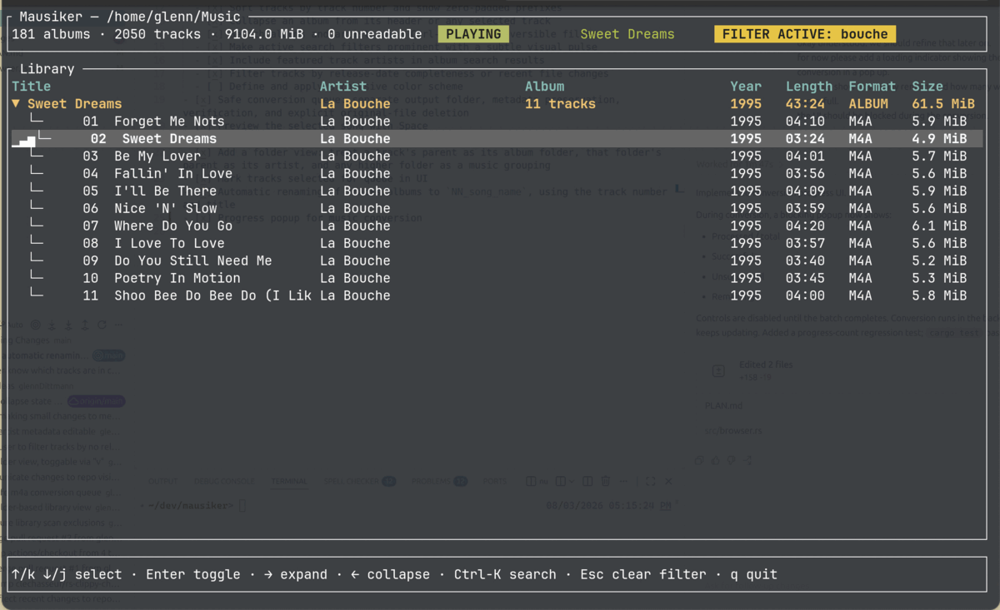

# mausiker

`mausiker` is a terminal music-library manager built with [Ratatui].



## Current capabilities

- Recursively scan common audio files and read their metadata without changing them.
- Browse a library grouped by album and primary artist; expand albums to see their tracks.
- Show track numbers, album duration, file size, format, and release year.
- Search album titles, primary artists, and featured track artists.
- Edit metadata from the terminal:
  - Album edits update the album title and release date across all tracks in that album.
  - Track edits update the title, album title, and release date for that track only.
  - Release dates are validated as `YYYY`, `YYYY-MM`, or `YYYY-MM-DD` before saving.
  - Edit fields have a blinking cursor; use `←` and `→` to insert, backspace, or delete text in place.
- Rename a selected track or all tracks in a selected album to `NN_Title.ext`, preserving their audio-file extension.
- Inspect the full file path for a selected track or album before renaming.
- Play a selected track with an animated playback indicator and scrolling now-playing title.
- Switch to a filesystem-oriented folder view, expanding top-level grouping folders into their albums and tracks.
- Exclude configured folders before scanning or reading metadata.
- Queue MP3, FLAC, WAV, and other non-M4A tracks for verified AAC/M4A conversion in a separate output library.

## Controls

| Key | Action |
| --- | --- |
| `j` / `↓`, `k` / `↑` | Move selection |
| `Enter` | Expand or collapse the selected album |
| `→` / `l`, `←` / `h` | Expand or collapse an album |
| `Space` | Play or stop the selected track |
| `e` | Edit selected album or track metadata |
| `i` | Show full file path(s) for the selected album or track |
| `r` | Rename selected track or album tracks to `NN_Title.ext` |
| `v` | Toggle metadata-album and filesystem-folder views |
| `c` | Add the selected track or album to the M4A conversion queue |
| `C` | Convert all queued tracks |
| `d` | Request deletion of verified conversion originals; confirm with `y` or cancel with `Esc` |
| `Ctrl-K` | Search albums and artists |
| `Esc` | Cancel an edit/search, clear an active filter, or quit |
| `q` | Quit |

## Playback requirement

Playback uses `ffplay`, and conversion uses `ffmpeg`; both are distributed with FFmpeg. Install FFmpeg and make sure `ffplay` and `ffmpeg` are available on your `PATH`. This works on Linux, macOS, or Windows when FFmpeg is installed.

## Excluding folders

Create a `.mausiker-exclude` file in the scanned music-library root. Add one relative or absolute folder per line; blank lines and lines beginning with `#` are ignored.

```text
# Do not include spoken-word content
Podcasts
Audiobooks
/mnt/archive/old-music
```

Excluded folders are skipped before Mausiker reads their audio metadata.

## Conversion queue

Select a track or expanded album and press `c` to queue its non-M4A tracks. Press `C` to convert the queue to AAC at 192 kbps, saving each M4A beside its original file. Mausiker maps metadata and attached artwork streams, then verifies each generated file before marking it complete.

Original files are always kept after conversion. Press `d` only when you are ready to remove successfully verified originals; the app asks for an explicit `y` confirmation and verifies each output once more before deletion. Existing output files are never overwritten.

## Run

Scan the current directory:

```sh
cargo run
```

Or scan a specific music directory:

```sh
cargo run -- /path/to/music
```

Conversion is intentionally not enabled yet: the next feature will build an explicit conversion queue with a separate output folder and post-conversion verification before any deletion can be offered.

[Ratatui]: https://ratatui.rs

## License

Copyright (c) glennDittmann <glenn.dittmann@posteo.de>

This project is licensed under the MIT license ([LICENSE] or <http://opensource.org/licenses/MIT>)

[LICENSE]: ./LICENSE
