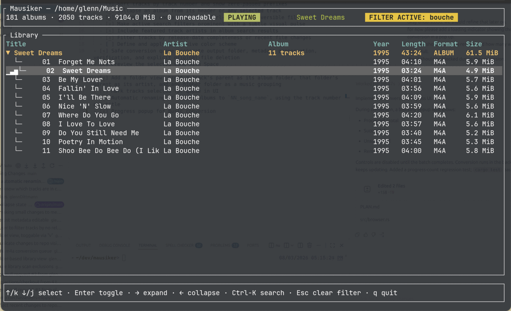

# mausiker

`mausiker` is a terminal music-library manager built with [Ratatui].



## Current capabilities

- Recursively scan common audio files and read their metadata without changing them.
- Browse a library grouped by album and primary artist; expand multi-disc albums into discs and tracks.
- Show track numbers, album duration, file size, format, and release year.
- Search album titles, primary artists, and featured track artists.
- Filter tracks missing either a release date or genre.
- Edit metadata from the terminal:
  - Album edits update the album artist, title, genre, and release date across all tracks in that album.
  - Single-disc album edits can assign disc number, disc total, and disc subtitle across the ripped disc in one save.
  - Multi-disc albums expand into separately editable disc rows; album-level edits preserve their different disc tags.
  - Track edits update the title, artist, album, genre, release date, and disc metadata for that track only.
  - Release dates are validated as `YYYY`, `YYYY-MM`, or `YYYY-MM-DD` before saving.
  - Disc numbers are validated as positive whole numbers, with the disc number no greater than the disc total.
  - Edit fields have a blinking cursor; use `←` and `→` to insert, backspace, or delete text in place.
- Rename a selected track or all tracks in a selected album to `NN_Title.ext`, preserving their audio-file extension.
- Inspect the full file path for a selected track or album before renaming.
- Compare selected album metadata with a read-only MusicBrainz lookup before changing any tags.
- Play the selected album's track list continuously from a chosen track, with an animated playback indicator and scrolling now-playing title.
- Switch to a filesystem-oriented folder view, expanding top-level grouping folders into their albums and tracks.
- Exclude configured folders before scanning or reading metadata.
- Queue MP3, FLAC, WAV, and other non-M4A tracks for verified AAC/M4A conversion in a separate output library.

## Controls

| Key | Action |
| --- | --- |
| `j / ↓ · k / ↑` | Move selection |
| `Enter` | Toggle selected album, disc, or folder |
| `→ / l` | Expand selected album, disc, or folder |
| `← / h` | Collapse selected album, disc, or folder |
| `Space` | Play or stop the selected album's track list |
| `e` | Edit selected album, disc, or track metadata |
| `i` | Show selected file path(s) |
| `m` | Compare selected album metadata with MusicBrainz |
| `r` | Review and rename selected track(s) |
| `v` | Toggle album-metadata and folder views |
| `f` | Choose a track filter |
| `c` | Toggle selected track, disc, album, or folder in the M4A queue |
| `C` | Review queued conversions, then start ready tracks |
| `d` | Review verified originals before deletion |
| `Ctrl-K` | Search albums and artists |
| `?` | Open or close this help |
| `Esc` | Cancel, clear search, or quit |
| `q` | Quit |

## Repairing split multi-disc albums

If a rip appears as one album per disc, edit each album row and give both discs the same album
title and album artist. In the same dialog, set the first disc to `1` of `2` and the second to
`2` of `2`; optionally give each a distinct disc subtitle. After both saves, Mausiker groups the
tracks into one album with separately expandable disc rows. Selecting a disc row and pressing `e`
updates that disc without changing the other disc's number or subtitle.

## Playback requirement

Playback uses `ffplay`, and conversion uses `ffmpeg`; both are distributed with FFmpeg. Install FFmpeg and make sure `ffplay` and `ffmpeg` are available on your `PATH`. This works on Linux, macOS, or Windows when FFmpeg is installed.

## Excluding folders

Create a `.mausiker-exclude` file in the scanned music-library root. Add one relative or absolute folder per line; blank lines and lines beginning with `#` are ignored.

```text
# Do not include spoken-word content
Podcasts
Audiobooks
/mnt/archive/old-music
```

Excluded folders are skipped before Mausiker reads their audio metadata.

## Conversion queue

Select a track or expanded album and press `c` to queue its non-M4A tracks. Press `C` to review each proposed output and any conflicts, then confirm conversion of ready tracks to AAC at 192 kbps. Each M4A is saved beside its original file; Mausiker maps metadata and attached artwork streams, then verifies each generated file before marking it complete.

Original files are always kept after conversion. Press `d` only when you are ready to remove successfully verified originals; the app asks for an explicit `y` confirmation and verifies each output once more before deletion. Existing output files are never overwritten.

## Run

Scan the current directory:

```sh
cargo run
```

Or scan a specific music directory:

```sh
cargo run -- /path/to/music
```

Conversion is intentionally not enabled yet: the next feature will build an explicit conversion queue with a separate output folder and post-conversion verification before any deletion can be offered.

[Ratatui]: https://ratatui.rs

## License

Copyright (c) glennDittmann <glenn.dittmann@posteo.de>

This project is licensed under the MIT license ([LICENSE] or <http://opensource.org/licenses/MIT>)

[LICENSE]: ./LICENSE
